

# RoboGen

**Visual examples for model, task, object, and modification outputs.**

---

## Examples

### Example 01

<table>
  <tr>
    <td width="50%"></td>
    <td width="50%"></td>
  </tr>
  <tr>
    <td align="center">Image A</td>
    <td align="center">Image B</td>
  </tr>
</table>

| Field | Value |
| --- | --- |
| **Model** | <!-- add model --> |
| **Task** | <!-- add task --> |
| **Object** | <!-- add object --> |
| **Modification** | <!-- add modification --> |
| **Model output** | <!-- add model output --> |
| **Root category** | <!-- add root category --> |
| **Note** | <!-- add note --> |

### Example 02

<table>
  <tr>
    <td width="50%"></td>
    <td width="50%"></td>
  </tr>
  <tr>
    <td align="center">Image A</td>
    <td align="center">Image B</td>
  </tr>
</table>

| Field | Value |
| --- | --- |
| **Model** | <!-- add model --> |
| **Task** | <!-- add task --> |
| **Object** | <!-- add object --> |
| **Modification** | <!-- add modification --> |
| **Model output** | <!-- add model output --> |
| **Root category** | <!-- add root category --> |
| **Note** | <!-- add note --> |

### Example 03

<table>
  <tr>
    <td width="50%"></td>
    <td width="50%"></td>
  </tr>
  <tr>
    <td align="center">Image A</td>
    <td align="center">Image B</td>
  </tr>
</table>

| Field | Value |
| --- | --- |
| **Model** | <!-- add model --> |
| **Task** | <!-- add task --> |
| **Object** | <!-- add object --> |
| **Modification** | <!-- add modification --> |
| **Model output** | <!-- add model output --> |
| **Root category** | <!-- add root category --> |
| **Note** | <!-- add note --> |

### Example 04

<table>
  <tr>
    <td width="50%"></td>
    <td width="50%"></td>
  </tr>
  <tr>
    <td align="center">Image A</td>
    <td align="center">Image B</td>
  </tr>
</table>

| Field | Value |
| --- | --- |
| **Model** | <!-- add model --> |
| **Task** | <!-- add task --> |
| **Object** | <!-- add object --> |
| **Modification** | <!-- add modification --> |
| **Model output** | <!-- add model output --> |
| **Root category** | <!-- add root category --> |
| **Note** | <!-- add note --> |

### Example 05

<table>
  <tr>
    <td width="50%"></td>
    <td width="50%"></td>
  </tr>
  <tr>
    <td align="center">Image A</td>
    <td align="center">Image B</td>
  </tr>
</table>

| Field | Value |
| --- | --- |
| **Model** | <!-- add model --> |
| **Task** | <!-- add task --> |
| **Object** | <!-- add object --> |
| **Modification** | <!-- add modification --> |
| **Model output** | <!-- add model output --> |
| **Root category** | <!-- add root category --> |
| **Note** | <!-- add note --> |

### Example 06

<table>
  <tr>
    <td width="50%"></td>
    <td width="50%">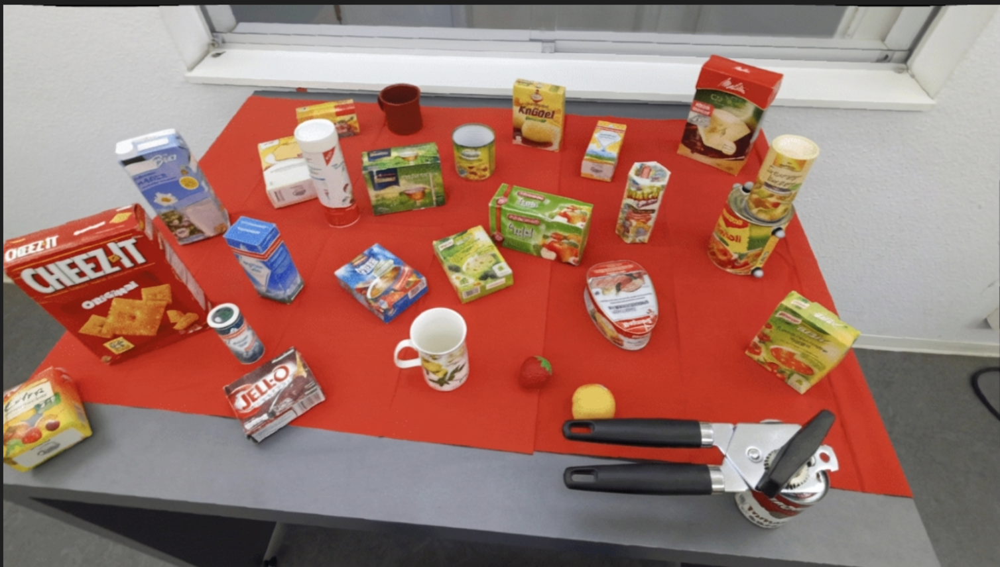</td>
  </tr>
  <tr>
    <td align="center">Image A</td>
    <td align="center">Image B</td>
  </tr>
</table>

| Field | Value |
| --- | --- |
| **Model** | <!-- add model --> |
| **Task** | <!-- add task --> |
| **Object** | <!-- add object --> |
| **Modification** | <!-- add modification --> |
| **Model output** | <!-- add model output --> |
| **Root category** | <!-- add root category --> |
| **Note** | <!-- add note --> |

### Example 07

<table>
  <tr>
    <td width="50%"></td>
    <td width="50%">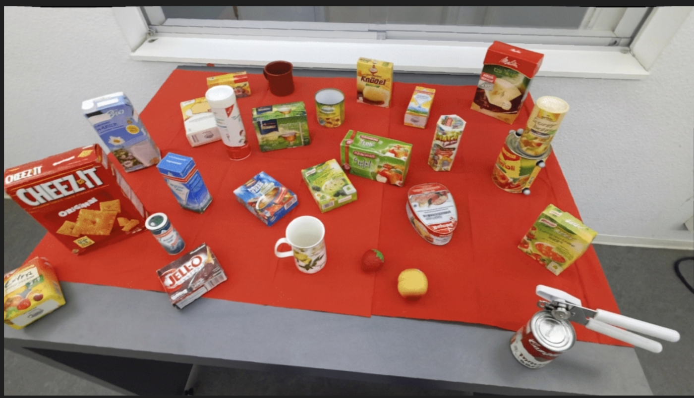</td>
  </tr>
  <tr>
    <td align="center">Image A</td>
    <td align="center">Image B</td>
  </tr>
</table>

| Field | Value |
| --- | --- |
| **Model** | <!-- add model --> |
| **Task** | <!-- add task --> |
| **Object** | <!-- add object --> |
| **Modification** | <!-- add modification --> |
| **Model output** | <!-- add model output --> |
| **Root category** | <!-- add root category --> |
| **Note** | <!-- add note --> |

### Example 08

<table>
  <tr>
    <td width="50%"></td>
    <td width="50%">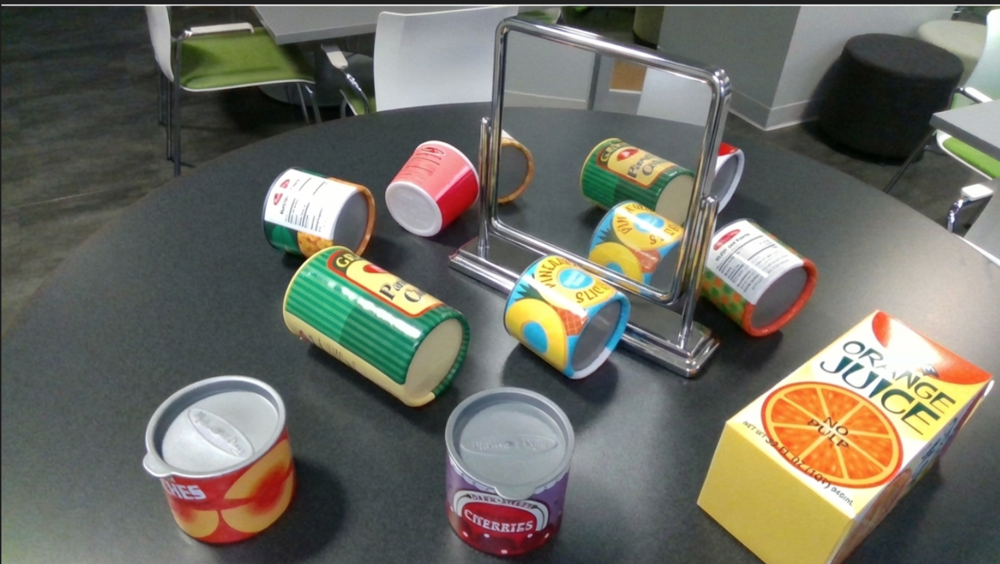</td>
  </tr>
  <tr>
    <td align="center">Image A</td>
    <td align="center">Image B</td>
  </tr>
</table>

| Field | Value |
| --- | --- |
| **Model** | <!-- add model --> |
| **Task** | <!-- add task --> |
| **Object** | <!-- add object --> |
| **Modification** | <!-- add modification --> |
| **Model output** | <!-- add model output --> |
| **Root category** | <!-- add root category --> |
| **Note** | <!-- add note --> |

### Example 09

<table>
  <tr>
    <td width="50%"></td>
    <td width="50%"></td>
  </tr>
  <tr>
    <td align="center">Image A</td>
    <td align="center">Image B</td>
  </tr>
</table>

| Field | Value |
| --- | --- |
| **Model** | <!-- add model --> |
| **Task** | <!-- add task --> |
| **Object** | <!-- add object --> |
| **Modification** | <!-- add modification --> |
| **Model output** | <!-- add model output --> |
| **Root category** | <!-- add root category --> |
| **Note** | <!-- add note --> |

### Example 10

<table>
  <tr>
    <td width="50%"></td>
    <td width="50%">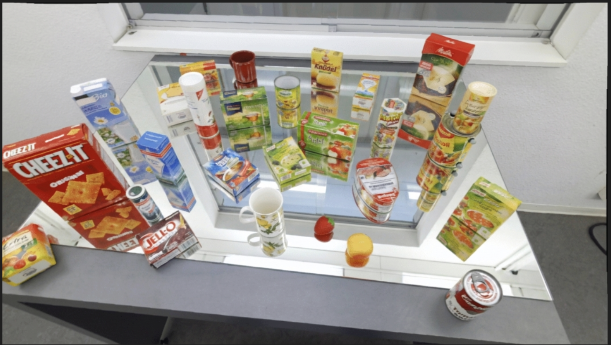</td>
  </tr>
  <tr>
    <td align="center">Image A</td>
    <td align="center">Image B</td>
  </tr>
</table>

| Field | Value |
| --- | --- |
| **Model** | <!-- add model --> |
| **Task** | <!-- add task --> |
| **Object** | <!-- add object --> |
| **Modification** | <!-- add modification --> |
| **Model output** | <!-- add model output --> |
| **Root category** | <!-- add root category --> |
| **Note** | <!-- add note --> |

### Example 11

<table>
  <tr>
    <td width="50%"></td>
    <td width="50%"></td>
  </tr>
  <tr>
    <td align="center">Image A</td>
    <td align="center">Image B</td>
  </tr>
</table>

| Field | Value |
| --- | --- |
| **Model** | <!-- add model --> |
| **Task** | <!-- add task --> |
| **Object** | <!-- add object --> |
| **Modification** | <!-- add modification --> |
| **Model output** | <!-- add model output --> |
| **Root category** | <!-- add root category --> |
| **Note** | <!-- add note --> |

### Example 12

<table>
  <tr>
    <td width="50%"></td>
    <td width="50%"></td>
  </tr>
  <tr>
    <td align="center">Image A</td>
    <td align="center">Image B</td>
  </tr>
</table>

| Field | Value |
| --- | --- |
| **Model** | <!-- add model --> |
| **Task** | <!-- add task --> |
| **Object** | <!-- add object --> |
| **Modification** | <!-- add modification --> |
| **Model output** | <!-- add model output --> |
| **Root category** | <!-- add root category --> |
| **Note** | <!-- add note --> |

### Example 13

<table>
  <tr>
    <td width="50%"></td>
    <td width="50%">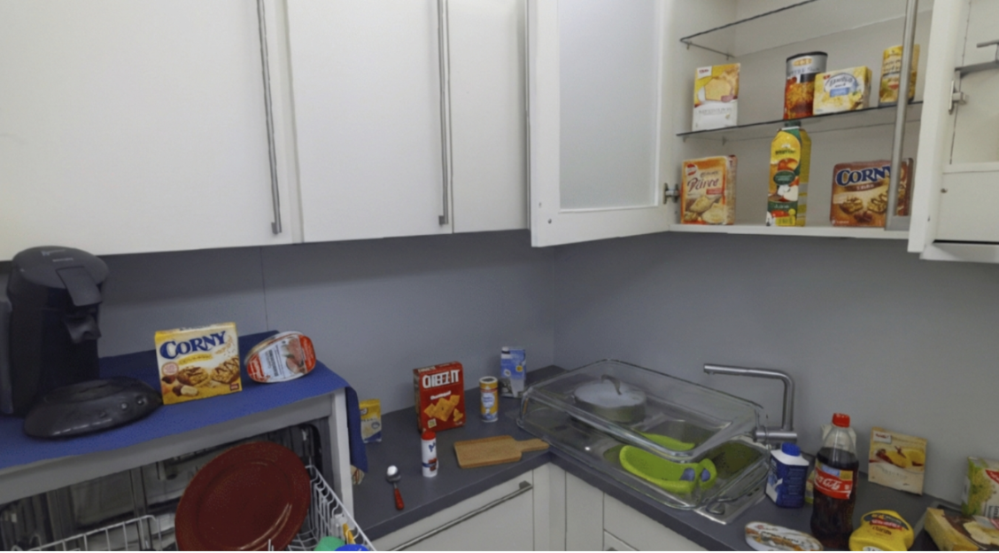</td>
  </tr>
  <tr>
    <td align="center">Image A</td>
    <td align="center">Image B</td>
  </tr>
</table>

| Field | Value |
| --- | --- |
| **Model** | <!-- add model --> |
| **Task** | <!-- add task --> |
| **Object** | <!-- add object --> |
| **Modification** | <!-- add modification --> |
| **Model output** | <!-- add model output --> |
| **Root category** | <!-- add root category --> |
| **Note** | <!-- add note --> |

### Example 14

<table>
  <tr>
    <td width="50%"></td>
    <td width="50%"></td>
  </tr>
  <tr>
    <td align="center">Image A</td>
    <td align="center">Image B</td>
  </tr>
</table>

| Field | Value |
| --- | --- |
| **Model** | <!-- add model --> |
| **Task** | <!-- add task --> |
| **Object** | <!-- add object --> |
| **Modification** | <!-- add modification --> |
| **Model output** | <!-- add model output --> |
| **Root category** | <!-- add root category --> |
| **Note** | <!-- add note --> |

### Example 15

<table>
  <tr>
    <td width="50%"></td>
    <td width="50%">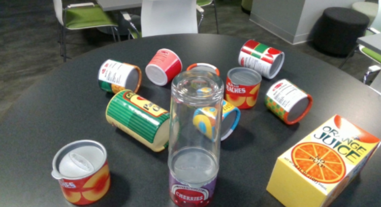</td>
  </tr>
  <tr>
    <td align="center">Image A</td>
    <td align="center">Image B</td>
  </tr>
</table>

| Field | Value |
| --- | --- |
| **Model** | <!-- add model --> |
| **Task** | <!-- add task --> |
| **Object** | <!-- add object --> |
| **Modification** | <!-- add modification --> |
| **Model output** | <!-- add model output --> |
| **Root category** | <!-- add root category --> |
| **Note** | <!-- add note --> |

### Example 16

<table>
  <tr>
    <td width="50%"></td>
    <td width="50%"></td>
  </tr>
  <tr>
    <td align="center">Image A</td>
    <td align="center">Image B</td>
  </tr>
</table>

| Field | Value |
| --- | --- |
| **Model** | <!-- add model --> |
| **Task** | <!-- add task --> |
| **Object** | <!-- add object --> |
| **Modification** | <!-- add modification --> |
| **Model output** | <!-- add model output --> |
| **Root category** | <!-- add root category --> |
| **Note** | <!-- add note --> |

### Example 17

<table>
  <tr>
    <td width="50%"></td>
    <td width="50%"></td>
  </tr>
  <tr>
    <td align="center">Image A</td>
    <td align="center">Image B</td>
  </tr>
</table>

| Field | Value |
| --- | --- |
| **Model** | <!-- add model --> |
| **Task** | <!-- add task --> |
| **Object** | <!-- add object --> |
| **Modification** | <!-- add modification --> |
| **Model output** | <!-- add model output --> |
| **Root category** | <!-- add root category --> |
| **Note** | <!-- add note --> |

### Example 18

<table>
  <tr>
    <td width="50%"></td>
    <td width="50%">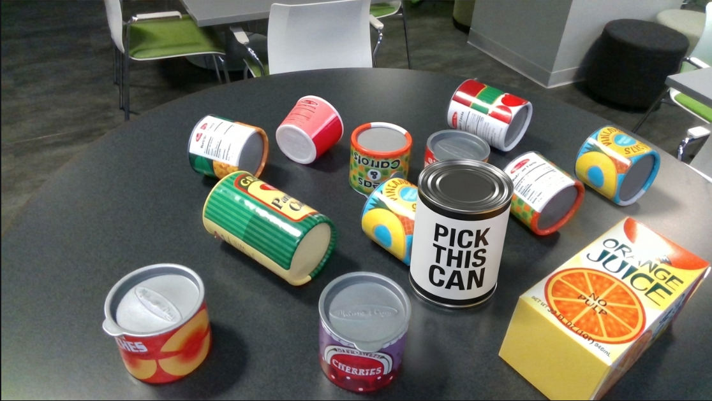</td>
  </tr>
  <tr>
    <td align="center">Image A</td>
    <td align="center">Image B</td>
  </tr>
</table>

| Field | Value |
| --- | --- |
| **Model** | <!-- add model --> |
| **Task** | <!-- add task --> |
| **Object** | <!-- add object --> |
| **Modification** | <!-- add modification --> |
| **Model output** | <!-- add model output --> |
| **Root category** | <!-- add root category --> |
| **Note** | <!-- add note --> |

### Example 19

<table>
  <tr>
    <td width="50%"></td>
    <td width="50%">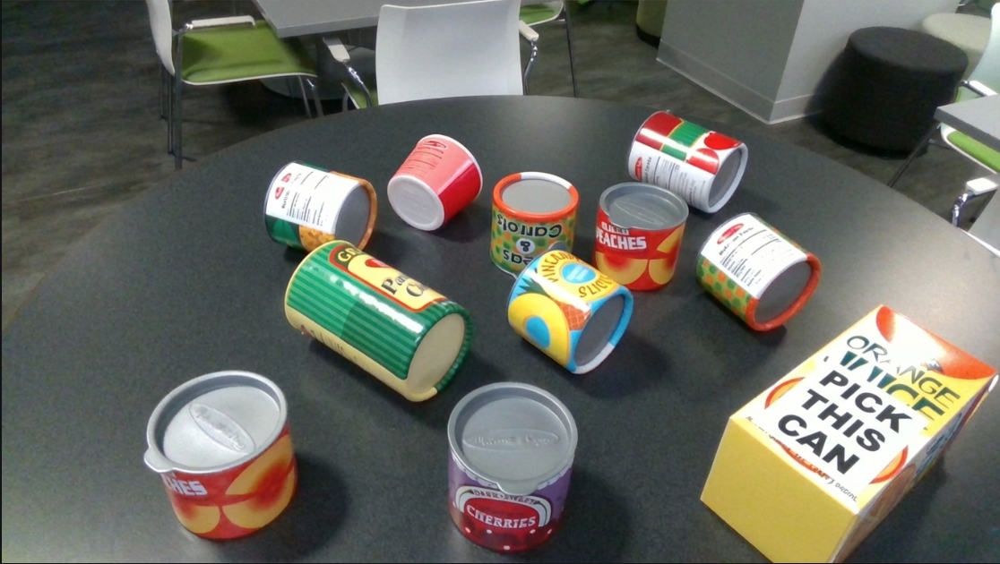</td>
  </tr>
  <tr>
    <td align="center">Image A</td>
    <td align="center">Image B</td>
  </tr>
</table>

| Field | Value |
| --- | --- |
| **Model** | <!-- add model --> |
| **Task** | <!-- add task --> |
| **Object** | <!-- add object --> |
| **Modification** | <!-- add modification --> |
| **Model output** | <!-- add model output --> |
| **Root category** | <!-- add root category --> |
| **Note** | <!-- add note --> |

### Example 20

<table>
  <tr>
    <td width="50%"></td>
    <td width="50%">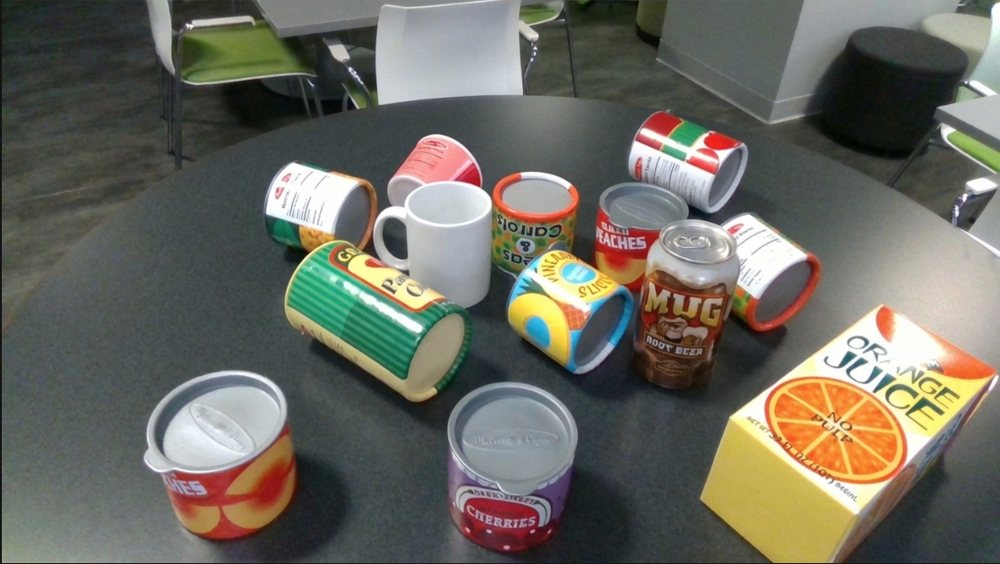</td>
  </tr>
  <tr>
    <td align="center">Image A</td>
    <td align="center">Image B</td>
  </tr>
</table>

| Field | Value |
| --- | --- |
| **Model** | <!-- add model --> |
| **Task** | <!-- add task --> |
| **Object** | <!-- add object --> |
| **Modification** | <!-- add modification --> |
| **Model output** | <!-- add model output --> |
| **Root category** | <!-- add root category --> |
| **Note** | <!-- add note --> |

### Example 21

<table>
  <tr>
    <td width="50%"></td>
    <td width="50%"></td>
  </tr>
  <tr>
    <td align="center">Image A</td>
    <td align="center">Image B</td>
  </tr>
</table>

| Field | Value |
| --- | --- |
| **Model** | <!-- add model --> |
| **Task** | <!-- add task --> |
| **Object** | <!-- add object --> |
| **Modification** | <!-- add modification --> |
| **Model output** | <!-- add model output --> |
| **Root category** | <!-- add root category --> |
| **Note** | <!-- add note --> |

### Example 22

<table>
  <tr>
    <td width="50%"></td>
    <td width="50%"></td>
  </tr>
  <tr>
    <td align="center">Image A</td>
    <td align="center">Image B</td>
  </tr>
</table>

| Field | Value |
| --- | --- |
| **Model** | <!-- add model --> |
| **Task** | <!-- add task --> |
| **Object** | <!-- add object --> |
| **Modification** | <!-- add modification --> |
| **Model output** | <!-- add model output --> |
| **Root category** | <!-- add root category --> |
| **Note** | <!-- add note --> |

### Example 23

<table>
  <tr>
    <td width="50%"></td>
    <td width="50%">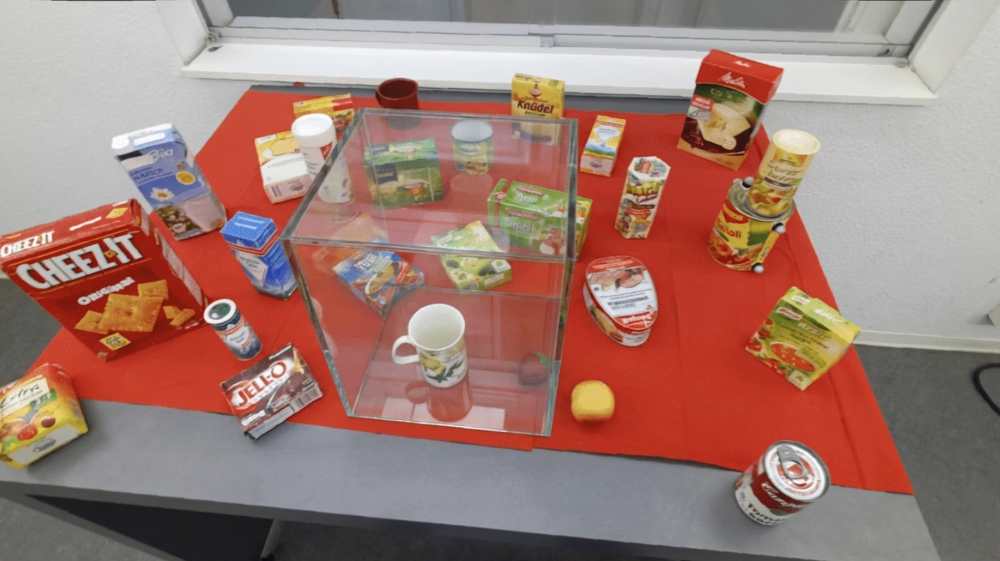</td>
  </tr>
  <tr>
    <td align="center">Image A</td>
    <td align="center">Image B</td>
  </tr>
</table>

| Field | Value |
| --- | --- |
| **Model** | <!-- add model --> |
| **Task** | <!-- add task --> |
| **Object** | <!-- add object --> |
| **Modification** | <!-- add modification --> |
| **Model output** | <!-- add model output --> |
| **Root category** | <!-- add root category --> |
| **Note** | <!-- add note --> |

### Example 24

<table>
  <tr>
    <td width="50%"></td>
    <td width="50%"></td>
  </tr>
  <tr>
    <td align="center">Image A</td>
    <td align="center">Image B</td>
  </tr>
</table>

| Field | Value |
| --- | --- |
| **Model** | <!-- add model --> |
| **Task** | <!-- add task --> |
| **Object** | <!-- add object --> |
| **Modification** | <!-- add modification --> |
| **Model output** | <!-- add model output --> |
| **Root category** | <!-- add root category --> |
| **Note** | <!-- add note --> |

### Example 25

<table>
  <tr>
    <td width="50%"></td>
    <td width="50%">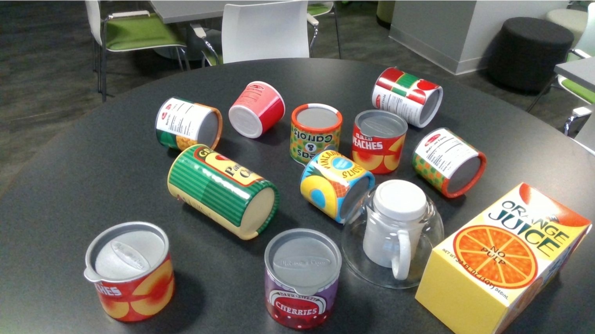</td>
  </tr>
  <tr>
    <td align="center">Image A</td>
    <td align="center">Image B</td>
  </tr>
</table>

| Field | Value |
| --- | --- |
| **Model** | <!-- add model --> |
| **Task** | <!-- add task --> |
| **Object** | <!-- add object --> |
| **Modification** | <!-- add modification --> |
| **Model output** | <!-- add model output --> |
| **Root category** | <!-- add root category --> |
| **Note** | <!-- add note --> |

### Example 26

<table>
  <tr>
    <td width="50%"></td>
    <td width="50%"></td>
  </tr>
  <tr>
    <td align="center">Image A</td>
    <td align="center">Image B</td>
  </tr>
</table>

| Field | Value |
| --- | --- |
| **Model** | <!-- add model --> |
| **Task** | <!-- add task --> |
| **Object** | <!-- add object --> |
| **Modification** | <!-- add modification --> |
| **Model output** | <!-- add model output --> |
| **Root category** | <!-- add root category --> |
| **Note** | <!-- add note --> |

### Example 27

<table>
  <tr>
    <td width="50%"></td>
    <td width="50%">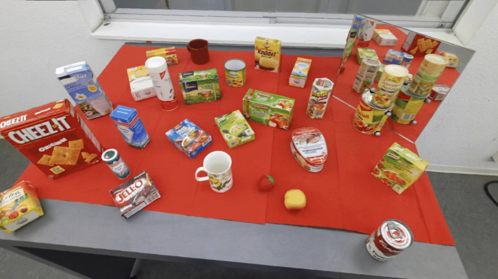</td>
  </tr>
  <tr>
    <td align="center">Image A</td>
    <td align="center">Image B</td>
  </tr>
</table>

| Field | Value |
| --- | --- |
| **Model** | <!-- add model --> |
| **Task** | <!-- add task --> |
| **Object** | <!-- add object --> |
| **Modification** | <!-- add modification --> |
| **Model output** | <!-- add model output --> |
| **Root category** | <!-- add root category --> |
| **Note** | <!-- add note --> |

### Example 28

<table>
  <tr>
    <td width="50%"></td>
    <td width="50%"></td>
  </tr>
  <tr>
    <td align="center">Image A</td>
    <td align="center">Image B</td>
  </tr>
</table>

| Field | Value |
| --- | --- |
| **Model** | <!-- add model --> |
| **Task** | <!-- add task --> |
| **Object** | <!-- add object --> |
| **Modification** | <!-- add modification --> |
| **Model output** | <!-- add model output --> |
| **Root category** | <!-- add root category --> |
| **Note** | <!-- add note --> |

### Example 29

<table>
  <tr>
    <td width="50%"></td>
    <td width="50%"></td>
  </tr>
  <tr>
    <td align="center">Image A</td>
    <td align="center">Image B</td>
  </tr>
</table>

| Field | Value |
| --- | --- |
| **Model** | <!-- add model --> |
| **Task** | <!-- add task --> |
| **Object** | <!-- add object --> |
| **Modification** | <!-- add modification --> |
| **Model output** | <!-- add model output --> |
| **Root category** | <!-- add root category --> |
| **Note** | <!-- add note --> |

### Example 30

<table>
  <tr>
    <td width="50%"></td>
    <td width="50%"></td>
  </tr>
  <tr>
    <td align="center">Image A</td>
    <td align="center">Image B</td>
  </tr>
</table>

| Field | Value |
| --- | --- |
| **Model** | <!-- add model --> |
| **Task** | <!-- add task --> |
| **Object** | <!-- add object --> |
| **Modification** | <!-- add modification --> |
| **Model output** | <!-- add model output --> |
| **Root category** | <!-- add root category --> |
| **Note** | <!-- add note --> |

### Example 31

<table>
  <tr>
    <td width="50%"></td>
    <td width="50%"></td>
  </tr>
  <tr>
    <td align="center">Image A</td>
    <td align="center">Image B</td>
  </tr>
</table>

| Field | Value |
| --- | --- |
| **Model** | <!-- add model --> |
| **Task** | <!-- add task --> |
| **Object** | <!-- add object --> |
| **Modification** | <!-- add modification --> |
| **Model output** | <!-- add model output --> |
| **Root category** | <!-- add root category --> |
| **Note** | <!-- add note --> |

### Example 32

<table>
  <tr>
    <td width="50%"></td>
    <td width="50%"></td>
  </tr>
  <tr>
    <td align="center">Image A</td>
    <td align="center">Image B</td>
  </tr>
</table>

| Field | Value |
| --- | --- |
| **Model** | <!-- add model --> |
| **Task** | <!-- add task --> |
| **Object** | <!-- add object --> |
| **Modification** | <!-- add modification --> |
| **Model output** | <!-- add model output --> |
| **Root category** | <!-- add root category --> |
| **Note** | <!-- add note --> |

### Example 33

<table>
  <tr>
    <td width="50%"></td>
    <td width="50%"></td>
  </tr>
  <tr>
    <td align="center">Image A</td>
    <td align="center">Image B</td>
  </tr>
</table>

| Field | Value |
| --- | --- |
| **Model** | <!-- add model --> |
| **Task** | <!-- add task --> |
| **Object** | <!-- add object --> |
| **Modification** | <!-- add modification --> |
| **Model output** | <!-- add model output --> |
| **Root category** | <!-- add root category --> |
| **Note** | <!-- add note --> |

### Example 34

<table>
  <tr>
    <td width="50%"></td>
    <td width="50%"></td>
  </tr>
  <tr>
    <td align="center">Image A</td>
    <td align="center">Image B</td>
  </tr>
</table>

| Field | Value |
| --- | --- |
| **Model** | <!-- add model --> |
| **Task** | <!-- add task --> |
| **Object** | <!-- add object --> |
| **Modification** | <!-- add modification --> |
| **Model output** | <!-- add model output --> |
| **Root category** | <!-- add root category --> |
| **Note** | <!-- add note --> |

### Example 35

<table>
  <tr>
    <td width="50%"></td>
    <td width="50%"></td>
  </tr>
  <tr>
    <td align="center">Image A</td>
    <td align="center">Image B</td>
  </tr>
</table>

| Field | Value |
| --- | --- |
| **Model** | <!-- add model --> |
| **Task** | <!-- add task --> |
| **Object** | <!-- add object --> |
| **Modification** | <!-- add modification --> |
| **Model output** | <!-- add model output --> |
| **Root category** | <!-- add root category --> |
| **Note** | <!-- add note --> |

### Example 36

<table>
  <tr>
    <td width="50%"></td>
    <td width="50%"></td>
  </tr>
  <tr>
    <td align="center">Image A</td>
    <td align="center">Image B</td>
  </tr>
</table>

| Field | Value |
| --- | --- |
| **Model** | <!-- add model --> |
| **Task** | <!-- add task --> |
| **Object** | <!-- add object --> |
| **Modification** | <!-- add modification --> |
| **Model output** | <!-- add model output --> |
| **Root category** | <!-- add root category --> |
| **Note** | <!-- add note --> |

### Example 37

<table>
  <tr>
    <td width="50%"></td>
    <td width="50%"></td>
  </tr>
  <tr>
    <td align="center">Image A</td>
    <td align="center">Image B</td>
  </tr>
</table>

| Field | Value |
| --- | --- |
| **Model** | <!-- add model --> |
| **Task** | <!-- add task --> |
| **Object** | <!-- add object --> |
| **Modification** | <!-- add modification --> |
| **Model output** | <!-- add model output --> |
| **Root category** | <!-- add root category --> |
| **Note** | <!-- add note --> |

### Example 38

<table>
  <tr>
    <td width="50%"></td>
    <td width="50%"></td>
  </tr>
  <tr>
    <td align="center">Image A</td>
    <td align="center">Image B</td>
  </tr>
</table>

| Field | Value |
| --- | --- |
| **Model** | <!-- add model --> |
| **Task** | <!-- add task --> |
| **Object** | <!-- add object --> |
| **Modification** | <!-- add modification --> |
| **Model output** | <!-- add model output --> |
| **Root category** | <!-- add root category --> |
| **Note** | <!-- add note --> |

### Example 39

<table>
  <tr>
    <td width="50%"></td>
    <td width="50%"></td>
  </tr>
  <tr>
    <td align="center">Image A</td>
    <td align="center">Image B</td>
  </tr>
</table>

| Field | Value |
| --- | --- |
| **Model** | <!-- add model --> |
| **Task** | <!-- add task --> |
| **Object** | <!-- add object --> |
| **Modification** | <!-- add modification --> |
| **Model output** | <!-- add model output --> |
| **Root category** | <!-- add root category --> |
| **Note** | <!-- add note --> |

### Example 40

<table>
  <tr>
    <td width="50%"></td>
    <td width="50%"></td>
  </tr>
  <tr>
    <td align="center">Image A</td>
    <td align="center">Image B</td>
  </tr>
</table>

| Field | Value |
| --- | --- |
| **Model** | <!-- add model --> |
| **Task** | <!-- add task --> |
| **Object** | <!-- add object --> |
| **Modification** | <!-- add modification --> |
| **Model output** | <!-- add model output --> |
| **Root category** | <!-- add root category --> |
| **Note** | <!-- add note --> |

### Example 41

<table>
  <tr>
    <td width="50%"></td>
    <td width="50%"></td>
  </tr>
  <tr>
    <td align="center">Image A</td>
    <td align="center">Image B</td>
  </tr>
</table>

| Field | Value |
| --- | --- |
| **Model** | <!-- add model --> |
| **Task** | <!-- add task --> |
| **Object** | <!-- add object --> |
| **Modification** | <!-- add modification --> |
| **Model output** | <!-- add model output --> |
| **Root category** | <!-- add root category --> |
| **Note** | <!-- add note --> |

### Example 42

<table>
  <tr>
    <td width="50%"></td>
    <td width="50%"></td>
  </tr>
  <tr>
    <td align="center">Image A</td>
    <td align="center">Image B</td>
  </tr>
</table>

| Field | Value |
| --- | --- |
| **Model** | <!-- add model --> |
| **Task** | <!-- add task --> |
| **Object** | <!-- add object --> |
| **Modification** | <!-- add modification --> |
| **Model output** | <!-- add model output --> |
| **Root category** | <!-- add root category --> |
| **Note** | <!-- add note --> |

### Example 43

<table>
  <tr>
    <td width="50%"></td>
    <td width="50%"></td>
  </tr>
  <tr>
    <td align="center">Image A</td>
    <td align="center">Image B</td>
  </tr>
</table>

| Field | Value |
| --- | --- |
| **Model** | <!-- add model --> |
| **Task** | <!-- add task --> |
| **Object** | <!-- add object --> |
| **Modification** | <!-- add modification --> |
| **Model output** | <!-- add model output --> |
| **Root category** | <!-- add root category --> |
| **Note** | <!-- add note --> |

### Example 44

<table>
  <tr>
    <td width="50%"></td>
    <td width="50%"></td>
  </tr>
  <tr>
    <td align="center">Image A</td>
    <td align="center">Image B</td>
  </tr>
</table>

| Field | Value |
| --- | --- |
| **Model** | <!-- add model --> |
| **Task** | <!-- add task --> |
| **Object** | <!-- add object --> |
| **Modification** | <!-- add modification --> |
| **Model output** | <!-- add model output --> |
| **Root category** | <!-- add root category --> |
| **Note** | <!-- add note --> |

### Example 45

<table>
  <tr>
    <td width="50%"></td>
    <td width="50%"></td>
  </tr>
  <tr>
    <td align="center">Image A</td>
    <td align="center">Image B</td>
  </tr>
</table>

| Field | Value |
| --- | --- |
| **Model** | <!-- add model --> |
| **Task** | <!-- add task --> |
| **Object** | <!-- add object --> |
| **Modification** | <!-- add modification --> |
| **Model output** | <!-- add model output --> |
| **Root category** | <!-- add root category --> |
| **Note** | <!-- add note --> |

### Example 46

<table>
  <tr>
    <td width="50%"></td>
    <td width="50%"></td>
  </tr>
  <tr>
    <td align="center">Image A</td>
    <td align="center">Image B</td>
  </tr>
</table>

| Field | Value |
| --- | --- |
| **Model** | <!-- add model --> |
| **Task** | <!-- add task --> |
| **Object** | <!-- add object --> |
| **Modification** | <!-- add modification --> |
| **Model output** | <!-- add model output --> |
| **Root category** | <!-- add root category --> |
| **Note** | <!-- add note --> |

### Example 47

<table>
  <tr>
    <td width="50%"></td>
    <td width="50%"></td>
  </tr>
  <tr>
    <td align="center">Image A</td>
    <td align="center">Image B</td>
  </tr>
</table>

| Field | Value |
| --- | --- |
| **Model** | <!-- add model --> |
| **Task** | <!-- add task --> |
| **Object** | <!-- add object --> |
| **Modification** | <!-- add modification --> |
| **Model output** | <!-- add model output --> |
| **Root category** | <!-- add root category --> |
| **Note** | <!-- add note --> |

### Example 48

<table>
  <tr>
    <td width="50%"></td>
    <td width="50%"></td>
  </tr>
  <tr>
    <td align="center">Image A</td>
    <td align="center">Image B</td>
  </tr>
</table>

| Field | Value |
| --- | --- |
| **Model** | <!-- add model --> |
| **Task** | <!-- add task --> |
| **Object** | <!-- add object --> |
| **Modification** | <!-- add modification --> |
| **Model output** | <!-- add model output --> |
| **Root category** | <!-- add root category --> |
| **Note** | <!-- add note --> |

### Example 49

<table>
  <tr>
    <td width="50%"></td>
    <td width="50%"></td>
  </tr>
  <tr>
    <td align="center">Image A</td>
    <td align="center">Image B</td>
  </tr>
</table>

| Field | Value |
| --- | --- |
| **Model** | <!-- add model --> |
| **Task** | <!-- add task --> |
| **Object** | <!-- add object --> |
| **Modification** | <!-- add modification --> |
| **Model output** | <!-- add model output --> |
| **Root category** | <!-- add root category --> |
| **Note** | <!-- add note --> |

### Example 50

<table>
  <tr>
    <td width="50%"></td>
    <td width="50%"></td>
  </tr>
  <tr>
    <td align="center">Image A</td>
    <td align="center">Image B</td>
  </tr>
</table>

| Field | Value |
| --- | --- |
| **Model** | <!-- add model --> |
| **Task** | <!-- add task --> |
| **Object** | <!-- add object --> |
| **Modification** | <!-- add modification --> |
| **Model output** | <!-- add model output --> |
| **Root category** | <!-- add root category --> |
| **Note** | <!-- add note --> |

### Example 51

<table>
  <tr>
    <td width="50%"></td>
    <td width="50%"></td>
  </tr>
  <tr>
    <td align="center">Image A</td>
    <td align="center">Image B</td>
  </tr>
</table>

| Field | Value |
| --- | --- |
| **Model** | <!-- add model --> |
| **Task** | <!-- add task --> |
| **Object** | <!-- add object --> |
| **Modification** | <!-- add modification --> |
| **Model output** | <!-- add model output --> |
| **Root category** | <!-- add root category --> |
| **Note** | <!-- add note --> |

### Example 52

<table>
  <tr>
    <td width="50%"></td>
    <td width="50%"></td>
  </tr>
  <tr>
    <td align="center">Image A</td>
    <td align="center">Image B</td>
  </tr>
</table>

| Field | Value |
| --- | --- |
| **Model** | <!-- add model --> |
| **Task** | <!-- add task --> |
| **Object** | <!-- add object --> |
| **Modification** | <!-- add modification --> |
| **Model output** | <!-- add model output --> |
| **Root category** | <!-- add root category --> |
| **Note** | <!-- add note --> |

### Example 53

<table>
  <tr>
    <td width="50%"></td>
    <td width="50%"></td>
  </tr>
  <tr>
    <td align="center">Image A</td>
    <td align="center">Image B</td>
  </tr>
</table>

| Field | Value |
| --- | --- |
| **Model** | <!-- add model --> |
| **Task** | <!-- add task --> |
| **Object** | <!-- add object --> |
| **Modification** | <!-- add modification --> |
| **Model output** | <!-- add model output --> |
| **Root category** | <!-- add root category --> |
| **Note** | <!-- add note --> |

### Example 54

<table>
  <tr>
    <td width="50%"></td>
    <td width="50%"></td>
  </tr>
  <tr>
    <td align="center">Image A</td>
    <td align="center">Image B</td>
  </tr>
</table>

| Field | Value |
| --- | --- |
| **Model** | <!-- add model --> |
| **Task** | <!-- add task --> |
| **Object** | <!-- add object --> |
| **Modification** | <!-- add modification --> |
| **Model output** | <!-- add model output --> |
| **Root category** | <!-- add root category --> |
| **Note** | <!-- add note --> |

### Example 55

<table>
  <tr>
    <td width="50%"></td>
    <td width="50%"></td>
  </tr>
  <tr>
    <td align="center">Image A</td>
    <td align="center">Image B</td>
  </tr>
</table>

| Field | Value |
| --- | --- |
| **Model** | <!-- add model --> |
| **Task** | <!-- add task --> |
| **Object** | <!-- add object --> |
| **Modification** | <!-- add modification --> |
| **Model output** | <!-- add model output --> |
| **Root category** | <!-- add root category --> |
| **Note** | <!-- add note --> |

### Example 56

<table>
  <tr>
    <td width="50%"></td>
    <td width="50%"></td>
  </tr>
  <tr>
    <td align="center">Image A</td>
    <td align="center">Image B</td>
  </tr>
</table>

| Field | Value |
| --- | --- |
| **Model** | <!-- add model --> |
| **Task** | <!-- add task --> |
| **Object** | <!-- add object --> |
| **Modification** | <!-- add modification --> |
| **Model output** | <!-- add model output --> |
| **Root category** | <!-- add root category --> |
| **Note** | <!-- add note --> |

### Example 57

<table>
  <tr>
    <td width="50%"></td>
    <td width="50%"></td>
  </tr>
  <tr>
    <td align="center">Image A</td>
    <td align="center">Image B</td>
  </tr>
</table>

| Field | Value |
| --- | --- |
| **Model** | <!-- add model --> |
| **Task** | <!-- add task --> |
| **Object** | <!-- add object --> |
| **Modification** | <!-- add modification --> |
| **Model output** | <!-- add model output --> |
| **Root category** | <!-- add root category --> |
| **Note** | <!-- add note --> |

### Example 58

<table>
  <tr>
    <td width="50%"></td>
    <td width="50%"></td>
  </tr>
  <tr>
    <td align="center">Image A</td>
    <td align="center">Image B</td>
  </tr>
</table>

| Field | Value |
| --- | --- |
| **Model** | <!-- add model --> |
| **Task** | <!-- add task --> |
| **Object** | <!-- add object --> |
| **Modification** | <!-- add modification --> |
| **Model output** | <!-- add model output --> |
| **Root category** | <!-- add root category --> |
| **Note** | <!-- add note --> |

### Example 59

<table>
  <tr>
    <td width="50%"></td>
    <td width="50%"></td>
  </tr>
  <tr>
    <td align="center">Image A</td>
    <td align="center">Image B</td>
  </tr>
</table>

| Field | Value |
| --- | --- |
| **Model** | <!-- add model --> |
| **Task** | <!-- add task --> |
| **Object** | <!-- add object --> |
| **Modification** | <!-- add modification --> |
| **Model output** | <!-- add model output --> |
| **Root category** | <!-- add root category --> |
| **Note** | <!-- add note --> |

### Example 60

<table>
  <tr>
    <td width="50%"></td>
    <td width="50%"></td>
  </tr>
  <tr>
    <td align="center">Image A</td>
    <td align="center">Image B</td>
  </tr>
</table>

| Field | Value |
| --- | --- |
| **Model** | <!-- add model --> |
| **Task** | <!-- add task --> |
| **Object** | <!-- add object --> |
| **Modification** | <!-- add modification --> |
| **Model output** | <!-- add model output --> |
| **Root category** | <!-- add root category --> |
| **Note** | <!-- add note --> |

### Example 61

<table>
  <tr>
    <td width="50%"></td>
    <td width="50%"></td>
  </tr>
  <tr>
    <td align="center">Image A</td>
    <td align="center">Image B</td>
  </tr>
</table>

| Field | Value |
| --- | --- |
| **Model** | <!-- add model --> |
| **Task** | <!-- add task --> |
| **Object** | <!-- add object --> |
| **Modification** | <!-- add modification --> |
| **Model output** | <!-- add model output --> |
| **Root category** | <!-- add root category --> |
| **Note** | <!-- add note --> |

### Example 62

<table>
  <tr>
    <td width="50%"></td>
    <td width="50%"></td>
  </tr>
  <tr>
    <td align="center">Image A</td>
    <td align="center">Image B</td>
  </tr>
</table>

| Field | Value |
| --- | --- |
| **Model** | <!-- add model --> |
| **Task** | <!-- add task --> |
| **Object** | <!-- add object --> |
| **Modification** | <!-- add modification --> |
| **Model output** | <!-- add model output --> |
| **Root category** | <!-- add root category --> |
| **Note** | <!-- add note --> |

### Example 63

<table>
  <tr>
    <td width="50%"></td>
    <td width="50%"></td>
  </tr>
  <tr>
    <td align="center">Image A</td>
    <td align="center">Image B</td>
  </tr>
</table>

| Field | Value |
| --- | --- |
| **Model** | <!-- add model --> |
| **Task** | <!-- add task --> |
| **Object** | <!-- add object --> |
| **Modification** | <!-- add modification --> |
| **Model output** | <!-- add model output --> |
| **Root category** | <!-- add root category --> |
| **Note** | <!-- add note --> |

### Example 64

<table>
  <tr>
    <td width="50%"></td>
    <td width="50%"></td>
  </tr>
  <tr>
    <td align="center">Image A</td>
    <td align="center">Image B</td>
  </tr>
</table>

| Field | Value |
| --- | --- |
| **Model** | <!-- add model --> |
| **Task** | <!-- add task --> |
| **Object** | <!-- add object --> |
| **Modification** | <!-- add modification --> |
| **Model output** | <!-- add model output --> |
| **Root category** | <!-- add root category --> |
| **Note** | <!-- add note --> |

### Example 65

<table>
  <tr>
    <td width="50%"></td>
    <td width="50%"></td>
  </tr>
  <tr>
    <td align="center">Image A</td>
    <td align="center">Image B</td>
  </tr>
</table>

| Field | Value |
| --- | --- |
| **Model** | <!-- add model --> |
| **Task** | <!-- add task --> |
| **Object** | <!-- add object --> |
| **Modification** | <!-- add modification --> |
| **Model output** | <!-- add model output --> |
| **Root category** | <!-- add root category --> |
| **Note** | <!-- add note --> |

### Example 66

<table>
  <tr>
    <td width="50%"></td>
    <td width="50%"></td>
  </tr>
  <tr>
    <td align="center">Image A</td>
    <td align="center">Image B</td>
  </tr>
</table>

| Field | Value |
| --- | --- |
| **Model** | <!-- add model --> |
| **Task** | <!-- add task --> |
| **Object** | <!-- add object --> |
| **Modification** | <!-- add modification --> |
| **Model output** | <!-- add model output --> |
| **Root category** | <!-- add root category --> |
| **Note** | <!-- add note --> |

### Example 67

<table>
  <tr>
    <td width="50%"></td>
    <td width="50%"></td>
  </tr>
  <tr>
    <td align="center">Image A</td>
    <td align="center">Image B</td>
  </tr>
</table>

| Field | Value |
| --- | --- |
| **Model** | <!-- add model --> |
| **Task** | <!-- add task --> |
| **Object** | <!-- add object --> |
| **Modification** | <!-- add modification --> |
| **Model output** | <!-- add model output --> |
| **Root category** | <!-- add root category --> |
| **Note** | <!-- add note --> |

### Example 68

<table>
  <tr>
    <td width="50%"></td>
    <td width="50%"></td>
  </tr>
  <tr>
    <td align="center">Image A</td>
    <td align="center">Image B</td>
  </tr>
</table>

| Field | Value |
| --- | --- |
| **Model** | <!-- add model --> |
| **Task** | <!-- add task --> |
| **Object** | <!-- add object --> |
| **Modification** | <!-- add modification --> |
| **Model output** | <!-- add model output --> |
| **Root category** | <!-- add root category --> |
| **Note** | <!-- add note --> |

### Example 69

<table>
  <tr>
    <td width="50%"></td>
    <td width="50%"></td>
  </tr>
  <tr>
    <td align="center">Image A</td>
    <td align="center">Image B</td>
  </tr>
</table>

| Field | Value |
| --- | --- |
| **Model** | <!-- add model --> |
| **Task** | <!-- add task --> |
| **Object** | <!-- add object --> |
| **Modification** | <!-- add modification --> |
| **Model output** | <!-- add model output --> |
| **Root category** | <!-- add root category --> |
| **Note** | <!-- add note --> |

### Example 70

<table>
  <tr>
    <td width="50%"></td>
    <td width="50%"></td>
  </tr>
  <tr>
    <td align="center">Image A</td>
    <td align="center">Image B</td>
  </tr>
</table>

| Field | Value |
| --- | --- |
| **Model** | <!-- add model --> |
| **Task** | <!-- add task --> |
| **Object** | <!-- add object --> |
| **Modification** | <!-- add modification --> |
| **Model output** | <!-- add model output --> |
| **Root category** | <!-- add root category --> |
| **Note** | <!-- add note --> |

### Example 71

<table>
  <tr>
    <td width="50%"></td>
    <td width="50%"></td>
  </tr>
  <tr>
    <td align="center">Image A</td>
    <td align="center">Image B</td>
  </tr>
</table>

| Field | Value |
| --- | --- |
| **Model** | <!-- add model --> |
| **Task** | <!-- add task --> |
| **Object** | <!-- add object --> |
| **Modification** | <!-- add modification --> |
| **Model output** | <!-- add model output --> |
| **Root category** | <!-- add root category --> |
| **Note** | <!-- add note --> |

### Example 72

<table>
  <tr>
    <td width="50%"></td>
    <td width="50%"></td>
  </tr>
  <tr>
    <td align="center">Image A</td>
    <td align="center">Image B</td>
  </tr>
</table>

| Field | Value |
| --- | --- |
| **Model** | <!-- add model --> |
| **Task** | <!-- add task --> |
| **Object** | <!-- add object --> |
| **Modification** | <!-- add modification --> |
| **Model output** | <!-- add model output --> |
| **Root category** | <!-- add root category --> |
| **Note** | <!-- add note --> |

### Example 73

<table>
  <tr>
    <td width="50%"></td>
    <td width="50%"></td>
  </tr>
  <tr>
    <td align="center">Image A</td>
    <td align="center">Image B</td>
  </tr>
</table>

| Field | Value |
| --- | --- |
| **Model** | <!-- add model --> |
| **Task** | <!-- add task --> |
| **Object** | <!-- add object --> |
| **Modification** | <!-- add modification --> |
| **Model output** | <!-- add model output --> |
| **Root category** | <!-- add root category --> |
| **Note** | <!-- add note --> |

### Example 74

<table>
  <tr>
    <td width="50%"></td>
    <td width="50%"></td>
  </tr>
  <tr>
    <td align="center">Image A</td>
    <td align="center">Image B</td>
  </tr>
</table>

| Field | Value |
| --- | --- |
| **Model** | <!-- add model --> |
| **Task** | <!-- add task --> |
| **Object** | <!-- add object --> |
| **Modification** | <!-- add modification --> |
| **Model output** | <!-- add model output --> |
| **Root category** | <!-- add root category --> |
| **Note** | <!-- add note --> |

### Example 75

<table>
  <tr>
    <td width="50%"></td>
    <td width="50%"></td>
  </tr>
  <tr>
    <td align="center">Image A</td>
    <td align="center">Image B</td>
  </tr>
</table>

| Field | Value |
| --- | --- |
| **Model** | <!-- add model --> |
| **Task** | <!-- add task --> |
| **Object** | <!-- add object --> |
| **Modification** | <!-- add modification --> |
| **Model output** | <!-- add model output --> |
| **Root category** | <!-- add root category --> |
| **Note** | <!-- add note --> |

### Example 76

<table>
  <tr>
    <td width="50%"></td>
    <td width="50%"></td>
  </tr>
  <tr>
    <td align="center">Image A</td>
    <td align="center">Image B</td>
  </tr>
</table>

| Field | Value |
| --- | --- |
| **Model** | <!-- add model --> |
| **Task** | <!-- add task --> |
| **Object** | <!-- add object --> |
| **Modification** | <!-- add modification --> |
| **Model output** | <!-- add model output --> |
| **Root category** | <!-- add root category --> |
| **Note** | <!-- add note --> |

### Example 77

<table>
  <tr>
    <td width="50%"></td>
    <td width="50%"></td>
  </tr>
  <tr>
    <td align="center">Image A</td>
    <td align="center">Image B</td>
  </tr>
</table>

| Field | Value |
| --- | --- |
| **Model** | <!-- add model --> |
| **Task** | <!-- add task --> |
| **Object** | <!-- add object --> |
| **Modification** | <!-- add modification --> |
| **Model output** | <!-- add model output --> |
| **Root category** | <!-- add root category --> |
| **Note** | <!-- add note --> |

### Example 78

<table>
  <tr>
    <td width="50%"></td>
    <td width="50%"></td>
  </tr>
  <tr>
    <td align="center">Image A</td>
    <td align="center">Image B</td>
  </tr>
</table>

| Field | Value |
| --- | --- |
| **Model** | <!-- add model --> |
| **Task** | <!-- add task --> |
| **Object** | <!-- add object --> |
| **Modification** | <!-- add modification --> |
| **Model output** | <!-- add model output --> |
| **Root category** | <!-- add root category --> |
| **Note** | <!-- add note --> |

### Example 79

<table>
  <tr>
    <td width="50%"></td>
    <td width="50%"></td>
  </tr>
  <tr>
    <td align="center">Image A</td>
    <td align="center">Image B</td>
  </tr>
</table>

| Field | Value |
| --- | --- |
| **Model** | <!-- add model --> |
| **Task** | <!-- add task --> |
| **Object** | <!-- add object --> |
| **Modification** | <!-- add modification --> |
| **Model output** | <!-- add model output --> |
| **Root category** | <!-- add root category --> |
| **Note** | <!-- add note --> |

### Example 80

<table>
  <tr>
    <td width="50%"></td>
    <td width="50%"></td>
  </tr>
  <tr>
    <td align="center">Image A</td>
    <td align="center">Image B</td>
  </tr>
</table>

| Field | Value |
| --- | --- |
| **Model** | <!-- add model --> |
| **Task** | <!-- add task --> |
| **Object** | <!-- add object --> |
| **Modification** | <!-- add modification --> |
| **Model output** | <!-- add model output --> |
| **Root category** | <!-- add root category --> |
| **Note** | <!-- add note --> |

### Example 81

<table>
  <tr>
    <td width="50%"></td>
    <td width="50%"></td>
  </tr>
  <tr>
    <td align="center">Image A</td>
    <td align="center">Image B</td>
  </tr>
</table>

| Field | Value |
| --- | --- |
| **Model** | <!-- add model --> |
| **Task** | <!-- add task --> |
| **Object** | <!-- add object --> |
| **Modification** | <!-- add modification --> |
| **Model output** | <!-- add model output --> |
| **Root category** | <!-- add root category --> |
| **Note** | <!-- add note --> |

### Example 82

<table>
  <tr>
    <td width="50%"></td>
    <td width="50%"></td>
  </tr>
  <tr>
    <td align="center">Image A</td>
    <td align="center">Image B</td>
  </tr>
</table>

| Field | Value |
| --- | --- |
| **Model** | <!-- add model --> |
| **Task** | <!-- add task --> |
| **Object** | <!-- add object --> |
| **Modification** | <!-- add modification --> |
| **Model output** | <!-- add model output --> |
| **Root category** | <!-- add root category --> |
| **Note** | <!-- add note --> |

### Example 83

<table>
  <tr>
    <td width="50%"></td>
    <td width="50%"></td>
  </tr>
  <tr>
    <td align="center">Image A</td>
    <td align="center">Image B</td>
  </tr>
</table>

| Field | Value |
| --- | --- |
| **Model** | <!-- add model --> |
| **Task** | <!-- add task --> |
| **Object** | <!-- add object --> |
| **Modification** | <!-- add modification --> |
| **Model output** | <!-- add model output --> |
| **Root category** | <!-- add root category --> |
| **Note** | <!-- add note --> |

### Example 84

<table>
  <tr>
    <td width="50%"></td>
    <td width="50%"></td>
  </tr>
  <tr>
    <td align="center">Image A</td>
    <td align="center">Image B</td>
  </tr>
</table>

| Field | Value |
| --- | --- |
| **Model** | <!-- add model --> |
| **Task** | <!-- add task --> |
| **Object** | <!-- add object --> |
| **Modification** | <!-- add modification --> |
| **Model output** | <!-- add model output --> |
| **Root category** | <!-- add root category --> |
| **Note** | <!-- add note --> |

### Example 85

<table>
  <tr>
    <td width="50%"></td>
    <td width="50%"></td>
  </tr>
  <tr>
    <td align="center">Image A</td>
    <td align="center">Image B</td>
  </tr>
</table>

| Field | Value |
| --- | --- |
| **Model** | <!-- add model --> |
| **Task** | <!-- add task --> |
| **Object** | <!-- add object --> |
| **Modification** | <!-- add modification --> |
| **Model output** | <!-- add model output --> |
| **Root category** | <!-- add root category --> |
| **Note** | <!-- add note --> |

### Example 86

<table>
  <tr>
    <td width="50%"></td>
    <td width="50%"></td>
  </tr>
  <tr>
    <td align="center">Image A</td>
    <td align="center">Image B</td>
  </tr>
</table>

| Field | Value |
| --- | --- |
| **Model** | <!-- add model --> |
| **Task** | <!-- add task --> |
| **Object** | <!-- add object --> |
| **Modification** | <!-- add modification --> |
| **Model output** | <!-- add model output --> |
| **Root category** | <!-- add root category --> |
| **Note** | <!-- add note --> |

### Example 87

<table>
  <tr>
    <td width="50%"></td>
    <td width="50%"></td>
  </tr>
  <tr>
    <td align="center">Image A</td>
    <td align="center">Image B</td>
  </tr>
</table>

| Field | Value |
| --- | --- |
| **Model** | <!-- add model --> |
| **Task** | <!-- add task --> |
| **Object** | <!-- add object --> |
| **Modification** | <!-- add modification --> |
| **Model output** | <!-- add model output --> |
| **Root category** | <!-- add root category --> |
| **Note** | <!-- add note --> |

### Example 88

<table>
  <tr>
    <td width="50%"></td>
    <td width="50%"></td>
  </tr>
  <tr>
    <td align="center">Image A</td>
    <td align="center">Image B</td>
  </tr>
</table>

| Field | Value |
| --- | --- |
| **Model** | <!-- add model --> |
| **Task** | <!-- add task --> |
| **Object** | <!-- add object --> |
| **Modification** | <!-- add modification --> |
| **Model output** | <!-- add model output --> |
| **Root category** | <!-- add root category --> |
| **Note** | <!-- add note --> |

### Example 89

<table>
  <tr>
    <td width="50%"></td>
    <td width="50%"></td>
  </tr>
  <tr>
    <td align="center">Image A</td>
    <td align="center">Image B</td>
  </tr>
</table>

| Field | Value |
| --- | --- |
| **Model** | <!-- add model --> |
| **Task** | <!-- add task --> |
| **Object** | <!-- add object --> |
| **Modification** | <!-- add modification --> |
| **Model output** | <!-- add model output --> |
| **Root category** | <!-- add root category --> |
| **Note** | <!-- add note --> |

### Example 90

<table>
  <tr>
    <td width="50%"></td>
    <td width="50%"></td>
  </tr>
  <tr>
    <td align="center">Image A</td>
    <td align="center">Image B</td>
  </tr>
</table>

| Field | Value |
| --- | --- |
| **Model** | <!-- add model --> |
| **Task** | <!-- add task --> |
| **Object** | <!-- add object --> |
| **Modification** | <!-- add modification --> |
| **Model output** | <!-- add model output --> |
| **Root category** | <!-- add root category --> |
| **Note** | <!-- add note --> |

### Example 91

<table>
  <tr>
    <td width="50%"></td>
    <td width="50%"></td>
  </tr>
  <tr>
    <td align="center">Image A</td>
    <td align="center">Image B</td>
  </tr>
</table>

| Field | Value |
| --- | --- |
| **Model** | <!-- add model --> |
| **Task** | <!-- add task --> |
| **Object** | <!-- add object --> |
| **Modification** | <!-- add modification --> |
| **Model output** | <!-- add model output --> |
| **Root category** | <!-- add root category --> |
| **Note** | <!-- add note --> |

### Example 92

<table>
  <tr>
    <td width="50%"></td>
    <td width="50%"></td>
  </tr>
  <tr>
    <td align="center">Image A</td>
    <td align="center">Image B</td>
  </tr>
</table>

| Field | Value |
| --- | --- |
| **Model** | <!-- add model --> |
| **Task** | <!-- add task --> |
| **Object** | <!-- add object --> |
| **Modification** | <!-- add modification --> |
| **Model output** | <!-- add model output --> |
| **Root category** | <!-- add root category --> |
| **Note** | <!-- add note --> |

## License

This project is released under the [MIT License](LICENSE).
