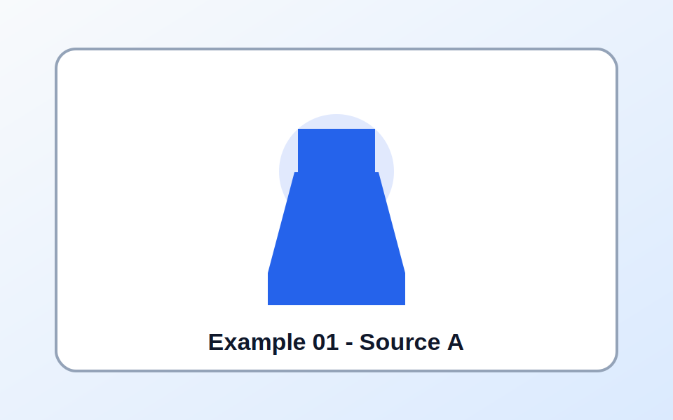
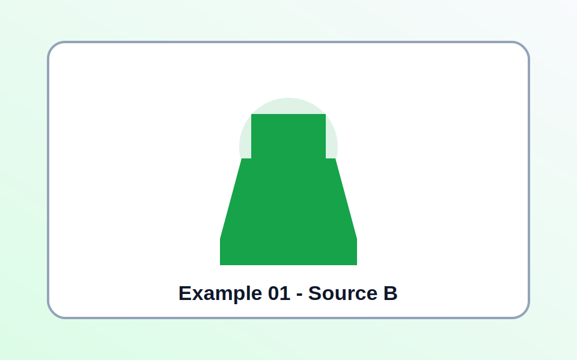
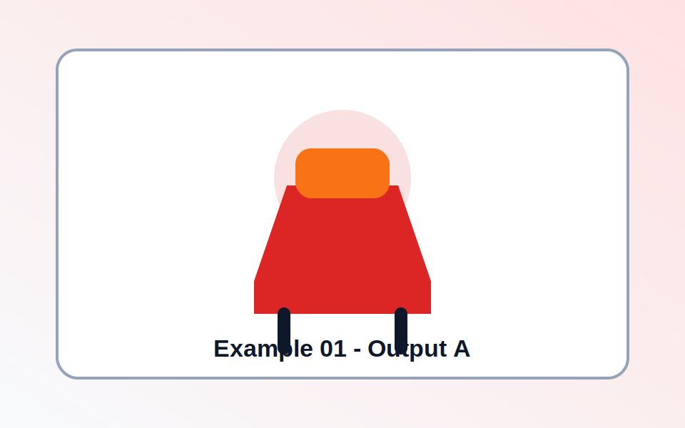
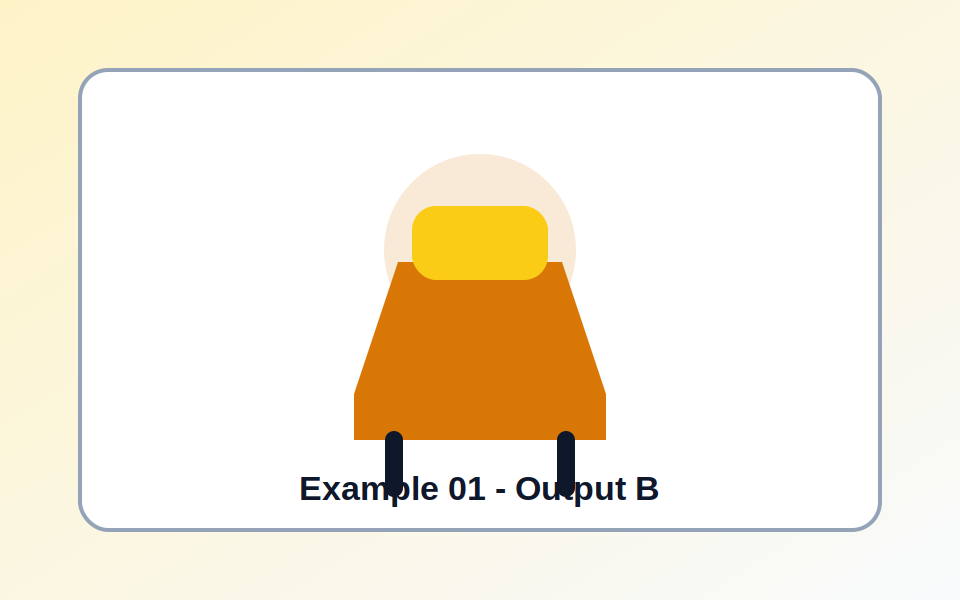
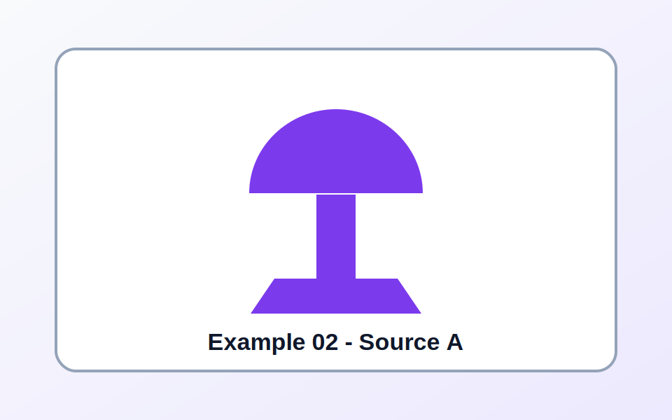
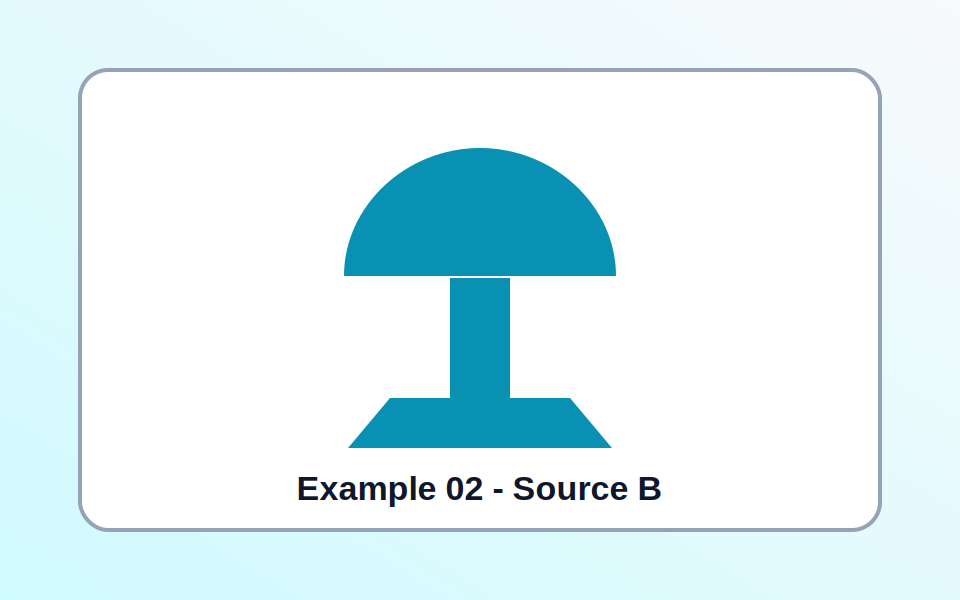
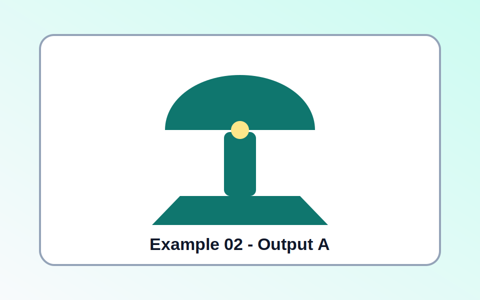
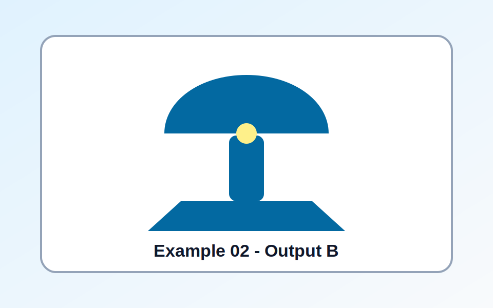

# RoboGen

**Visual examples for model, task, object, and modification outputs.**

---

## Examples

### Example 01

<table>
  <tr>
    <td width="50%"></td>
    <td width="50%"></td>
  </tr>
  <tr>
    <td align="center">Source image A</td>
    <td align="center">Source image B</td>
  </tr>
</table>

| Field | Value |
| --- | --- |
| **Model** | RoboGen preview model |
| **Task** | Object editing and generation |
| **Object** | Chair |
| **Modification** | Add a soft seat cushion and simplify the frame |
| **Model output** | A cleaner chair concept with the requested visual change applied |
| **Root category** | Furniture |
| **Note** | Placeholder example for README layout testing |

<table>
  <tr>
    <td width="50%"></td>
    <td width="50%"></td>
  </tr>
  <tr>
    <td align="center">Output image A</td>
    <td align="center">Output image B</td>
  </tr>
</table>

### Example 02

<table>
  <tr>
    <td width="50%"></td>
    <td width="50%"></td>
  </tr>
  <tr>
    <td align="center">Source image A</td>
    <td align="center">Source image B</td>
  </tr>
</table>

| Field | Value |
| --- | --- |
| **Model** | RoboGen preview model |
| **Task** | Object transformation |
| **Object** | Table lamp |
| **Modification** | Make the base wider and change the shade shape |
| **Model output** | A revised lamp design with a stronger base and adjusted silhouette |
| **Root category** | Home object |
| **Note** | Placeholder example for README layout testing |

<table>
  <tr>
    <td width="50%"></td>
    <td width="50%"></td>
  </tr>
  <tr>
    <td align="center">Output image A</td>
    <td align="center">Output image B</td>
  </tr>
</table>

## License

This project is released under the [MIT License](LICENSE).
